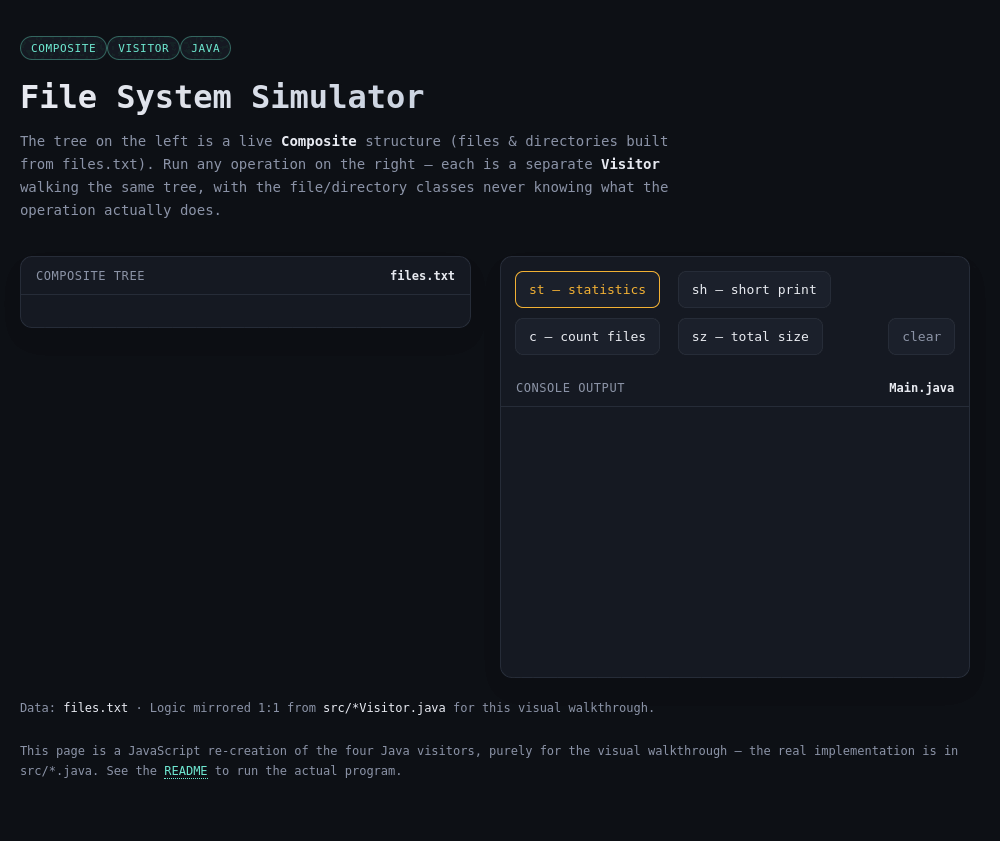
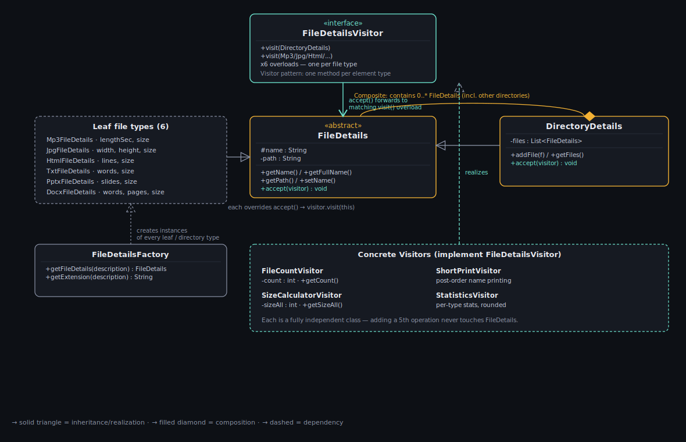

<h1 align="center">📁 File System Simulator</h1>
<p align="center"><b>Composite</b> + <b>Visitor</b> design patterns in Java</p>

<p align="center">
  
  
  
</p>

<p align="center">
  
</p>

<p align="center"><b><a href="https://saritnerya.github.io/file-system-composite-visitor/">🚀 Launch the Interactive File System Demo</a></b></p>
---

## About

This project simulates a file system: a tree of files and directories built from a text description file (`files.txt`), with four operations that can run on it — counting files, printing names, calculating total size, and printing detailed per-file-type statistics.

It was built as an assignment for **Object-Oriented Design for Engineering**, and its core purpose is to show two design patterns that complement each other beautifully:

- **Composite** — represent a hierarchical structure (files inside directories, directories inside directories) so client code treats a single file and an entire subtree the exact same way.
- **Visitor** — add new operations on the tree (count, print, size, statistics) **without ever touching** the file/directory classes themselves. Each operation is its own self-contained class.

The payoff: adding a brand-new tree operation (say, "find the largest file") never requires touching an existing file class — only adding one new Visitor.

## UML

<p align="center">
  
</p>

## How to run

```bash
javac -d out src/*.java
java -cp out Main
```

The program reads `files.txt` from the project root (not from `src`).

## Sample run

```
Choose from the following options:
q: quit
c: countFiles
st: statistics
sh: short
sz: size
st
The bitrate of song.mp3 is 22 bytes per second.
The picture icon.jpg has an average of 1 bytes per pixel.
The file text.txt contains 583 words.
The file other.html contains 128 lines.
The average slide size in Presentation Swed.pptx is 20020.
Directory folder has 1 files.
Directory doc has 3 files.
The file word.docx has an average of 343 words per page.
Directory folder2 has 1 files.
The picture pic.jpg has an average of 8 bytes per pixel.
Directory root has 7 files.
```

## The interactive demo

[`index.html`](index.html) is a standalone, dependency-free page that visualizes the exact same tree, running all four Visitors live and highlighting the post-order traversal as it happens. It's a small JavaScript re-implementation of the same logic purely so the pattern is visible without running anything locally — the real logic lives in `src/*Visitor.java`.

## Project structure

```
.
├── src/                  # Java source files
│   ├── FileDetails.java
│   ├── FileDetailsVisitor.java
│   ├── DirectoryDetails.java
│   ├── Mp3FileDetails.java
│   ├── JpgFileDetails.java
│   ├── HtmlFileDetails.java
│   ├── TxtFileDetails.java
│   ├── DocxFileDetails.java
│   ├── PptxFileDetails.java
│   ├── FileDetailsFactory.java
│   ├── FileCountVisitor.java
│   ├── ShortPrintVisitor.java
│   ├── SizeCalculatorVisitor.java
│   ├── StatisticsVisitor.java
│   └── Main.java
├── files.txt             # sample input
├── index.html            # interactive visual demo
├── uml.svg                # class diagram
└── README.md
```

---

<p align="center"><sub>Object-Oriented Design for Engineering — assignment on Composite &amp; Visitor design patterns.</sub></p>
