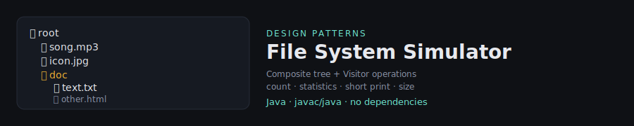

<p align="center">
  
</p>

<h1 align="center">File System Simulator</h1>
<p align="center"><b>Composite</b> + <b>Visitor</b> design patterns in Java</p>

<p align="center">
  
  
  
</p>

---

## 🇮🇱 עברית

### על הפרויקט

פרויקט זה מדמה מערכת קבצים — עץ של קבצים ותיקיות הנבנה מקובץ טקסט תיאורי
(`files.txt`), ומאפשר להריץ עליו כמה פעולות שונות: ספירת קבצים, הדפסת שמות,
חישוב גודל כולל, וסטטיסטיקות מפורטות לכל סוג קובץ.

הפרויקט נכתב כתרגיל בקורס **עיצוב ותכנות מונחה עצמים להנדסה**, והמטרה המרכזית
שלו הייתה לתרגל שני עקרונות מרכזיים בעיצוב מונחה עצמים:

- **Composite** — לייצג מבנה היררכי (קבצים בתוך תיקיות, תיקיות בתוך תיקיות)
  כך שקוד הלקוח יכול להתייחס לקובץ בודד ולתת-עץ שלם באותו האופן בדיוק.
- **Visitor** — להוסיף פעולות חדשות על העץ (ספירה, הדפסה, חישוב גודל,
  סטטיסטיקות) **בלי לגעת בכלל** במחלקות הקבצים והתיקיות עצמן. כל פעולה היא
  מחלקה נפרדת ועצמאית.

השילוב הזה הוא אחד הדברים שהכי אהבתי ללמוד בקורס: איך שתי תבניות עיצוב
שלכאורה עוסקות בדברים שונים (מבנה מול התנהגות) משלימות אחת את השנייה בצורה
כל כך טבעית.

### מה סופק ע"י הקורס ומה מימשתי בעצמי

כדי לשמור על שקיפות מלאה לגבי מה שלי ומה שניתן כשלד:

| קובץ | מקור |
|---|---|
| `FileDetailsFactory.java` | סופק ע"י הקורס (פרסינג של שורת התיאור) |
| `files.txt` | סופק ע"י הקורס — קובץ קלט לבדיקה |
| `FileDetails.java`, `FileDetailsVisitor.java` | שלד שסופק + הושלם על ידי (חתימת `accept`, ממשק ה-Visitor) |
| `DirectoryDetails.java` וכל ה-`*FileDetails.java` האחרים | מימשתי בעצמי (התבנית Composite) |
| `FileCountVisitor`, `ShortPrintVisitor`, `SizeCalculatorVisitor`, `StatisticsVisitor` | מימשתי בעצמי במלואם (התבנית Visitor) |
| `Main.java` | שלד שסופק + השלמתי (תפריט אינטראקטיבי, כולל תיקון קטן — ראו למטה) |

### תיקון שביצעתי

בבדיקה חוזרת של הקוד מול דוגמת ההרצה בהנחיות, שמתי לב ששתי הפעולות `c`
(ספירת קבצים) ו-`sz` (גודל כולל) הפעילו את ה-Visitor המתאים אך **לא הדפיסו
את התוצאה** לפלט. הוספתי את שורות ההדפסה החסרות כך שהפלט תואם במדויק לדוגמת
ההרצה הרשמית (`Found 7 files` / `the total size is 466949 bytes`).

### איך מריצים

```bash
javac -d out src/*.java
java -cp out Main
```

הפעלה מוחזרת אל `files.txt` שנמצא בשורש הפרויקט (לא בתוך `src`).

### דוגמת הרצה

```
Choose from the following options:
q: quit
c: countFiles
st: statistics
sh: short
sz: size
st
The bitrate of song.mp3 is 22 bytes per second.
The picture icon.jpg has an average of 1 bytes per pixel.
The file text.txt contains 583 words.
The file other.html contains 128 lines.
The average slide size in Presentation Swed.pptx is 20020.
Directory folder has 1 files.
Directory doc has 3 files.
The file word.docx has an average of 343 words per page.
Directory folder2 has 1 files.
The picture pic.jpg has an average of 8 bytes per pixel.
Directory root has 7 files.
```

### הדגמה חזותית — `demo.html`

בקובץ [`demo.html`](demo.html) יש הדמיה אינטראקטיבית של אותו עץ קבצים
בדפדפן — לחיצה על כל אחת מהפעולות מריצה מעבר post-order על העץ (בדיוק כמו
ה-Visitor האמיתי ב-Java) ומדגישה כל צומת בזמן אמת. זו לא תחליף לקוד — היא
כלי המחשה בלבד, מיועדת למי שרוצה להבין בעין את סדר הביקור בעץ.

**להרצה:** הורידו את `demo.html` ופתחו בדפדפן, או הפעילו GitHub Pages על
הריפו הזה כדי לקבל קישור חי.

### מבנה הפרויקט

```
.
├── src/                     # קוד המקור ב-Java
│   ├── FileDetails.java
│   ├── FileDetailsVisitor.java
│   ├── DirectoryDetails.java
│   ├── Mp3FileDetails.java
│   ├── JpgFileDetails.java
│   ├── HtmlFileDetails.java
│   ├── TxtFileDetails.java
│   ├── DocxFileDetails.java
│   ├── PptxFileDetails.java
│   ├── FileDetailsFactory.java
│   ├── FileCountVisitor.java
│   ├── ShortPrintVisitor.java
│   ├── SizeCalculatorVisitor.java
│   ├── StatisticsVisitor.java
│   └── Main.java
├── files.txt                # קלט לדוגמה
├── demo.html                 # הדגמה ויזואלית אינטראקטיבית
└── README.md
```

---

## 🇬🇧 English

### About

This project simulates a file system: a tree of files and directories built
from a text description file (`files.txt`), with four different operations
that can be run on it — counting files, printing names, calculating total
size, and printing detailed per-file-type statistics.

It was built as an assignment for **Object-Oriented Design (OOD) for
Engineering**, and its core purpose was to practice two design patterns that
complement each other beautifully:

- **Composite** — represent a hierarchical structure (files inside
  directories, directories inside directories) so client code can treat a
  single file and an entire subtree the exact same way.
- **Visitor** — add new operations on the tree (count, print, size,
  statistics) **without ever touching** the file/directory classes
  themselves. Each operation is its own self-contained class.

### Provided vs. self-implemented

For full transparency about what was given as a skeleton vs. what I wrote:

| File | Source |
|---|---|
| `FileDetailsFactory.java` | Provided by the course (parses description lines) |
| `files.txt` | Provided by the course — sample input |
| `FileDetails.java`, `FileDetailsVisitor.java` | Skeleton provided + completed by me (the `accept` contract, the Visitor interface) |
| `DirectoryDetails.java` and every other `*FileDetails.java` | Implemented by me (the Composite pattern) |
| `FileCountVisitor`, `ShortPrintVisitor`, `SizeCalculatorVisitor`, `StatisticsVisitor` | Fully implemented by me (the Visitor pattern) |
| `Main.java` | Skeleton provided + completed by me (interactive menu, including a small fix — see below) |

### A bug I fixed

While double-checking the code against the assignment's sample run, I noticed
the `c` (count files) and `sz` (total size) menu options ran the correct
visitor but **never printed the result**. I added the missing print
statements so the output now matches the official sample run exactly
(`Found 7 files` / `the total size is 466949 bytes`).

### How to run

```bash
javac -d out src/*.java
java -cp out Main
```

The program reads `files.txt` from the project root (not from `src`).

### Sample run

```
Choose from the following options:
q: quit
c: countFiles
st: statistics
sh: short
sz: size
sh
song.mp3
icon.jpg
text.txt
other.html
Swed.pptx
folder
doc
word.docx
folder2
pic.jpg
root
```

### Visual walkthrough — `demo.html`

[`demo.html`](demo.html) is a small interactive, dependency-free page that
mirrors the same file tree in the browser. Clicking any operation runs a
post-order walk over the tree — exactly like the real Java Visitor — and
highlights each node as it's visited. It's not a replacement for the code,
just a way to *see* the traversal order at a glance.

**To view it:** download `demo.html` and open it in a browser, or enable
GitHub Pages on this repo for a live link.

### Project structure

```
.
├── src/                     # Java source files
│   ├── FileDetails.java
│   ├── FileDetailsVisitor.java
│   ├── DirectoryDetails.java
│   ├── Mp3FileDetails.java
│   ├── JpgFileDetails.java
│   ├── HtmlFileDetails.java
│   ├── TxtFileDetails.java
│   ├── DocxFileDetails.java
│   ├── PptxFileDetails.java
│   ├── FileDetailsFactory.java
│   ├── FileCountVisitor.java
│   ├── ShortPrintVisitor.java
│   ├── SizeCalculatorVisitor.java
│   ├── StatisticsVisitor.java
│   └── Main.java
├── files.txt                 # sample input
├── demo.html                  # interactive visual demo
└── README.md
```

---

<p align="center"><sub>Object-Oriented Design for Engineering — assignment on Composite &amp; Visitor design patterns.</sub></p>
